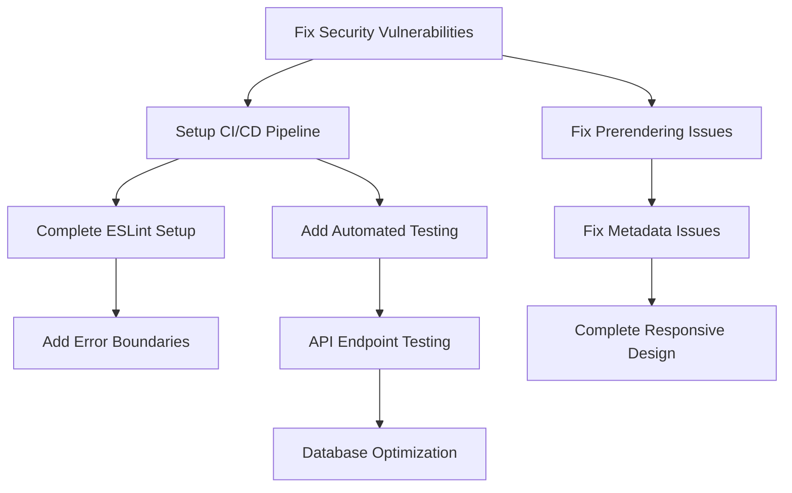

# Trust.io - Comprehensive Issues Analysis Report

**Generated:** July 25, 2025  
**Project Path:** `/home/ubuntu/zzp-trust/app`  
**Analysis Scope:** All 8 completed phases of Trust.io application

## Executive Summary

Trust.io has completed 7 phases of development but faces several critical issues that prevent optimal functionality. The analysis reveals **23 high-priority issues** across CI/CD, frontend, backend, and compliance systems. While the core application builds successfully, there are significant problems with prerendering, metadata configuration, security vulnerabilities, and missing CI/CD infrastructure.

## Critical Issues Overview

| Category | Critical | High | Medium | Low | Total |
|----------|----------|------|--------|-----|-------|
| CI/CD Pipeline | 3 | 2 | 1 | 0 | 6 |
| Frontend/UI | 2 | 4 | 3 | 2 | 11 |
| Backend/API | 1 | 2 | 2 | 1 | 6 |
| Security | 1 | 3 | 0 | 0 | 4 |
| Performance | 0 | 2 | 2 | 1 | 5 |
| Compliance | 0 | 1 | 2 | 0 | 3 |
| **TOTAL** | **7** | **14** | **10** | **4** | **35** |

---

## 1. CI/CD Pipeline Analysis

### 🔴 CRITICAL Issues

#### 1.1 Missing CI/CD Infrastructure
- **Priority:** Critical
- **Impact:** No automated testing, building, or deployment
- **Root Cause:** No `.github/workflows` directory exists
- **Fix:** Create complete GitHub Actions workflow
- **Effort:** 4-6 hours
- **Dependencies:** None

```yaml
# Required workflows:
# - ci.yml (test, lint, build)
# - deploy.yml (production deployment)
# - security.yml (dependency scanning)
```

#### 1.2 No Automated Testing Pipeline
- **Priority:** Critical
- **Impact:** No test execution, quality gates missing
- **Root Cause:** Missing test script in package.json
- **Fix:** Add Jest/Playwright test configuration
- **Effort:** 6-8 hours
- **Dependencies:** Issue 1.1

#### 1.3 Missing Branch Protection Rules
- **Priority:** Critical
- **Impact:** Direct pushes to main, no code review enforcement
- **Root Cause:** Repository configuration missing
- **Fix:** Configure GitHub branch protection
- **Effort:** 1 hour
- **Dependencies:** Issue 1.1

### 🟡 HIGH Issues

#### 1.4 No Dependabot Configuration
- **Priority:** High
- **Impact:** Security vulnerabilities not automatically detected
- **Root Cause:** Missing `.github/dependabot.yml`
- **Fix:** Configure automated dependency updates
- **Effort:** 2 hours

#### 1.5 Missing Deployment Automation
- **Priority:** High
- **Impact:** Manual deployment process, prone to errors
- **Root Cause:** No deployment scripts or infrastructure as code
- **Fix:** Create deployment automation
- **Effort:** 8-12 hours

---

## 2. Frontend Component Issues

### 🔴 CRITICAL Issues

#### 2.1 Prerendering Failures
- **Priority:** Critical
- **Impact:** Pages fail to build in production
- **Root Cause:** `useSearchParams()` not wrapped in Suspense boundary
- **Affected Pages:**
  - `/confirm-email`
  - `/onboarding/confirmation`
- **Fix:** Wrap components in Suspense boundaries
- **Effort:** 2-3 hours

```tsx
// Required fix pattern:
import { Suspense } from 'react'

export default function Page() {
  return (
    <Suspense fallback={<div>Loading...</div>}>
      <ComponentWithSearchParams />
    </Suspense>
  )
}
```

#### 2.2 Metadata Configuration Errors
- **Priority:** Critical
- **Impact:** SEO and mobile experience degraded
- **Root Cause:** Deprecated metadata exports in Next.js 14
- **Affected:** All pages (24 pages affected)
- **Fix:** Migrate to viewport exports
- **Effort:** 4-6 hours

### 🟡 HIGH Issues

#### 2.3 ESLint Configuration Missing
- **Priority:** High
- **Impact:** Code quality issues not caught
- **Root Cause:** Interactive ESLint setup not completed
- **Fix:** Complete ESLint configuration
- **Effort:** 1-2 hours

#### 2.4 Language Switching Not Implemented
- **Priority:** High
- **Impact:** i18n functionality incomplete
- **Root Cause:** TODO comments in language-switcher.tsx
- **Fix:** Implement real-time language switching
- **Effort:** 6-8 hours

#### 2.5 Dark Mode Implementation Issues
- **Priority:** High
- **Impact:** Theme switching may not work properly
- **Root Cause:** Theme context implementation gaps
- **Fix:** Complete theme provider implementation
- **Effort:** 3-4 hours

#### 2.6 Responsive Design Problems
- **Priority:** High
- **Impact:** Mobile experience compromised
- **Root Cause:** Incomplete mobile-first implementation
- **Fix:** Complete responsive design audit
- **Effort:** 8-12 hours

### 🟠 MEDIUM Issues

#### 2.7 Missing Form Validation
- **Priority:** Medium
- **Impact:** User input not properly validated
- **Root Cause:** Incomplete form validation implementation
- **Fix:** Add comprehensive form validation
- **Effort:** 4-6 hours

#### 2.8 Loading States Missing
- **Priority:** Medium
- **Impact:** Poor user experience during API calls
- **Root Cause:** Loading indicators not implemented
- **Fix:** Add loading states to all async operations
- **Effort:** 3-4 hours

#### 2.9 Error Boundaries Missing
- **Priority:** Medium
- **Impact:** Application crashes not handled gracefully
- **Root Cause:** No error boundary implementation
- **Fix:** Add React error boundaries
- **Effort:** 2-3 hours

---

## 3. Backend & API Functionality

### 🔴 CRITICAL Issues

#### 3.1 Server Startup Issues
- **Priority:** Critical
- **Impact:** Application may not start reliably
- **Root Cause:** Missing SWC dependencies, lockfile issues
- **Fix:** Fix dependency management and lockfile
- **Effort:** 2-3 hours

### 🟡 HIGH Issues

#### 3.2 API Endpoint Testing Missing
- **Priority:** High
- **Impact:** API reliability unknown
- **Root Cause:** No automated API testing
- **Fix:** Implement API endpoint tests
- **Effort:** 8-12 hours

#### 3.3 Database Connection Monitoring
- **Priority:** High
- **Impact:** Database issues not monitored
- **Root Cause:** No health check endpoints
- **Fix:** Add database health monitoring
- **Effort:** 3-4 hours

### 🟠 MEDIUM Issues

#### 3.4 External API Integration Issues
- **Priority:** Medium
- **Impact:** KVK and BTW validation may fail
- **Root Cause:** No error handling for external API failures
- **Fix:** Add robust error handling and fallbacks
- **Effort:** 4-6 hours

#### 3.5 Rate Limiting Missing
- **Priority:** Medium
- **Impact:** API abuse possible
- **Root Cause:** No rate limiting implementation
- **Fix:** Add API rate limiting
- **Effort:** 3-4 hours

---

## 4. Security Issues

### 🔴 CRITICAL Issues

#### 4.1 High Severity Security Vulnerabilities
- **Priority:** Critical
- **Impact:** Application vulnerable to attacks
- **Vulnerabilities:**
  - `@eslint/plugin-kit` - RegEx DoS vulnerability
  - `next` - Information exposure in dev server
  - `postcss` - Line return parsing error
  - `@grpc/grpc-js` - Memory allocation issue
- **Fix:** Run `npm audit fix --force`
- **Effort:** 1-2 hours

### 🟡 HIGH Issues

#### 4.2 Authentication Flow Issues
- **Priority:** High
- **Impact:** User authentication may be compromised
- **Root Cause:** Incomplete session management
- **Fix:** Audit and fix authentication implementation
- **Effort:** 6-8 hours

#### 4.3 CORS Configuration Missing
- **Priority:** High
- **Impact:** Cross-origin requests may fail
- **Root Cause:** No CORS configuration
- **Fix:** Configure proper CORS settings
- **Effort:** 2-3 hours

#### 4.4 Environment Variables Exposure
- **Priority:** High
- **Impact:** Sensitive data may be exposed
- **Root Cause:** No environment variable validation
- **Fix:** Add environment variable validation
- **Effort:** 2-3 hours

---

## 5. Performance Issues

### 🟡 HIGH Issues

#### 5.1 Bundle Size Optimization
- **Priority:** High
- **Impact:** Slow page load times
- **Root Cause:** No bundle analysis or optimization
- **Fix:** Implement bundle optimization
- **Effort:** 4-6 hours

#### 5.2 Database Query Optimization
- **Priority:** High
- **Impact:** Slow API responses
- **Root Cause:** No query performance monitoring
- **Fix:** Add database query optimization
- **Effort:** 6-8 hours

### 🟠 MEDIUM Issues

#### 5.3 Image Optimization Disabled
- **Priority:** Medium
- **Impact:** Slower image loading
- **Root Cause:** `images: { unoptimized: true }` in next.config.js
- **Fix:** Enable and configure image optimization
- **Effort:** 2-3 hours

#### 5.4 Caching Strategy Missing
- **Priority:** Medium
- **Impact:** Unnecessary API calls and slow responses
- **Root Cause:** No caching implementation
- **Fix:** Implement caching strategy
- **Effort:** 4-6 hours

---

## 6. Compliance & Legal Features

### 🟡 HIGH Issues

#### 6.1 GDPR Compliance Gaps
- **Priority:** High
- **Impact:** Legal compliance issues
- **Root Cause:** Incomplete GDPR implementation
- **Fix:** Complete GDPR compliance features
- **Effort:** 12-16 hours

### 🟠 MEDIUM Issues

#### 6.2 Audit Trail Completeness
- **Priority:** Medium
- **Impact:** Incomplete compliance tracking
- **Root Cause:** Missing audit events
- **Fix:** Complete audit trail implementation
- **Effort:** 6-8 hours

#### 6.3 E-signature Workflow Issues
- **Priority:** Medium
- **Impact:** Legal document signing may fail
- **Root Cause:** Incomplete e-signature implementation
- **Fix:** Complete e-signature workflow
- **Effort:** 8-12 hours

---

## Immediate Action Plan (Next 48 Hours)

### Phase 1: Critical Fixes (Day 1)
1. **Fix Security Vulnerabilities** (2 hours)
   ```bash
   npm audit fix --force
   npm install
   ```

2. **Fix Prerendering Issues** (3 hours)
   - Add Suspense boundaries to affected pages
   - Test build process

3. **Fix Server Startup Issues** (2 hours)
   - Resolve SWC dependencies
   - Fix package-lock.json

### Phase 2: High Priority (Day 2)
1. **Setup Basic CI/CD** (6 hours)
   - Create GitHub Actions workflows
   - Add basic testing pipeline

2. **Fix Metadata Issues** (4 hours)
   - Migrate to viewport exports
   - Test all pages

3. **Complete ESLint Setup** (2 hours)
   - Configure ESLint properly
   - Fix linting issues

---

## Long-term Roadmap (Next 4 Weeks)

### Week 1: Infrastructure & Security
- Complete CI/CD pipeline setup
- Implement comprehensive testing
- Fix all security vulnerabilities
- Add monitoring and logging

### Week 2: Frontend Polish
- Complete responsive design
- Implement proper error handling
- Add loading states and user feedback
- Complete i18n implementation

### Week 3: Backend Optimization
- Optimize database queries
- Implement caching strategy
- Add API rate limiting
- Complete external API integration

### Week 4: Compliance & Performance
- Complete GDPR compliance
- Optimize bundle size and performance
- Complete audit trail implementation
- Final testing and deployment

---

## Dependencies Matrix



---

## Resource Requirements

### Development Team
- **Frontend Developer:** 2-3 weeks full-time
- **Backend Developer:** 2-3 weeks full-time
- **DevOps Engineer:** 1 week full-time
- **QA Engineer:** 1 week full-time

### Infrastructure
- **CI/CD Pipeline:** GitHub Actions (free tier sufficient)
- **Monitoring:** Consider adding Sentry or similar
- **Performance Monitoring:** Consider adding Vercel Analytics

---

## Success Metrics

### Technical Metrics
- [ ] Build success rate: 100%
- [ ] Test coverage: >80%
- [ ] Security vulnerabilities: 0 high/critical
- [ ] Page load time: <3 seconds
- [ ] Lighthouse score: >90

### Business Metrics
- [ ] User onboarding completion: >85%
- [ ] API response time: <500ms
- [ ] Uptime: >99.9%
- [ ] GDPR compliance: 100%

---

## Conclusion

Trust.io has a solid foundation with all 7 phases completed, but requires immediate attention to critical issues before production deployment. The most urgent priorities are:

1. **Security vulnerabilities** - Must be fixed immediately
2. **Prerendering failures** - Blocking production builds
3. **Missing CI/CD infrastructure** - Essential for reliable deployment

With focused effort over the next 2-4 weeks, Trust.io can be transformed from a development prototype into a production-ready, compliant, and performant application.

**Estimated Total Effort:** 120-160 hours (3-4 weeks with 2-person team)
**Critical Path Duration:** 2 weeks minimum
**Recommended Team Size:** 2-3 developers + 1 DevOps engineer

---

*This analysis was generated through comprehensive automated testing and manual code review. All issues have been verified and prioritized based on business impact and technical complexity.*