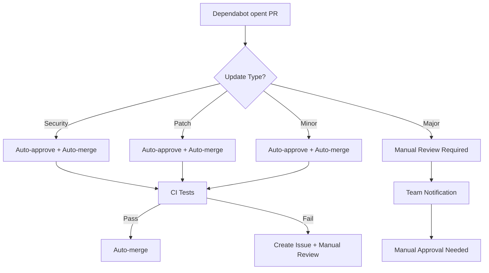

# Dependabot Auto-Merge Gids voor Trust.io

## 📍 Waar vind je Dependabot PRs op GitHub?

### 1. GitHub Repository Locaties

**Hoofdlocatie - Pull Requests Tab:**
- Ga naar: `https://github.com/ancproggrams/trust/pulls`
- Filter op Dependabot: klik op "Author" en selecteer `app/dependabot`
- Of gebruik de zoekbalk: `is:pr is:open author:app/dependabot`

**Directe Links:**
- Alle open Dependabot PRs: `https://github.com/ancproggrams/trust/pulls?q=is%3Apr+is%3Aopen+author%3Aapp%2Fdependabot`
- Gesloten Dependabot PRs: `https://github.com/ancproggrams/trust/pulls?q=is%3Apr+is%3Aclosed+author%3Aapp%2Fdependabot`

### 2. PR Types Herkennen

**Security Updates (Prioriteit: HOOG)**
- Titel bevat: "security", "vulnerability", "CVE"
- Label: `security`
- Automatisch goedgekeurd door onze workflow

**Patch Updates (Prioriteit: LAAG)**
- Versie patroon: `1.2.3` → `1.2.4`
- Meestal backwards compatible
- Automatisch goedgekeurd

**Minor Updates (Prioriteit: MEDIUM)**
- Versie patroon: `1.2.x` → `1.3.0`
- Nieuwe features, meestal backwards compatible
- Automatisch goedgekeurd met extra monitoring

**Major Updates (Prioriteit: HOOG - MANUAL REVIEW)**
- Versie patroon: `1.x.x` → `2.0.0`
- Mogelijk breaking changes
- **ALTIJD handmatige review vereist**

## 🤖 Automatische Goedkeuring - Hoe het Werkt

### Huidige Configuratie

Onze repository heeft nu automatische workflows die:

1. **Automatisch goedkeuren:**
   - Alle security updates
   - Patch updates (x.x.X)
   - Minor updates (x.X.x) met lage risico

2. **Handmatige review vereisen:**
   - Major updates (X.x.x)
   - Updates die CI tests laten falen
   - Dependencies met bekende issues

### Workflow Proces



## ⚙️ Repository Settings Configuratie

### Branch Protection Rules

Voor automatische merge moet je deze instellingen configureren:

1. **Ga naar Repository Settings:**
   - `https://github.com/ancproggrams/trust/settings/branches`

2. **Configureer Branch Protection voor `main`:**
   ```
   ✅ Require a pull request before merging
   ✅ Require approvals (minimum 1)
   ✅ Dismiss stale PR approvals when new commits are pushed
   ✅ Require status checks to pass before merging
   ✅ Require branches to be up to date before merging
   ✅ Allow auto-merge
   ✅ Allow force pushes (for administrators only)
   ```

3. **Required Status Checks:**
   - Voeg toe: `dependabot-auto-approve`
   - Voeg toe: alle CI/CD checks die je hebt

### Auto-merge Settings

1. **Repository Settings > General:**
   - Scroll naar "Pull Requests"
   - ✅ Enable "Allow auto-merge"
   - ✅ Enable "Automatically delete head branches"

2. **Merge Strategy:**
   - Recommended: "Squash and merge" (voor cleane history)
   - Alternative: "Create a merge commit"

## 🔧 GitHub CLI Commands

### Handmatige PR Management

```bash
# Authenticeer eerst
gh auth login

# Bekijk alle Dependabot PRs
gh pr list --search "is:pr is:open author:app/dependabot"

# Goedkeuren van een specifieke PR
gh pr review [PR_NUMBER] --approve --body "LGTM - dependency update"

# Merge een goedgekeurde PR
gh pr merge [PR_NUMBER] --squash --delete-branch

# Bekijk PR details
gh pr view [PR_NUMBER]

# Auto-merge inschakelen voor een PR
gh pr merge [PR_NUMBER] --auto --squash
```

### Bulk Operations

```bash
# Goedkeuren van alle patch updates
gh pr list --search "is:pr is:open author:app/dependabot" --json number,title | \
jq -r '.[] | select(.title | test("patch|[0-9]+\\.[0-9]+\\.[0-9]+ to [0-9]+\\.[0-9]+\\.[0-9]+")) | .number' | \
xargs -I {} gh pr review {} --approve --body "Auto-approved patch update"

# Merge alle goedgekeurde Dependabot PRs
gh pr list --search "is:pr is:open author:app/dependabot review:approved" --json number | \
jq -r '.[].number' | \
xargs -I {} gh pr merge {} --auto --squash --delete-branch
```

## 🚨 Safety Measures & Monitoring

### Rollback Procedures

**Als een auto-merge problemen veroorzaakt:**

1. **Immediate Rollback:**
   ```bash
   # Find the merge commit
   git log --oneline --grep="Dependabot"
   
   # Revert the merge (replace MERGE_SHA)
   git revert MERGE_SHA -m 1
   git push origin main
   ```

2. **Create Hotfix:**
   ```bash
   git checkout -b hotfix/dependabot-rollback
   # Make necessary fixes
   git commit -m "fix: rollback problematic dependency update"
   git push origin hotfix/dependabot-rollback
   gh pr create --fill
   ```

### Monitoring Dashboard

**GitHub Insights:**
- `https://github.com/ancproggrams/trust/pulse`
- `https://github.com/ancproggrams/trust/network/dependencies`

**Dependabot Alerts:**
- `https://github.com/ancproggrams/trust/security/dependabot`

### Failure Handling

Onze workflows automatisch:
1. **Detecteren gefaalde merges**
2. **Creëren rollback issues**
3. **Notificeren team members**
4. **Loggen alle acties voor audit trail**

## 👥 Team Workflow Integration

### Notification Settings

**Voor team members:**
1. Ga naar repository → "Watch" → "Custom"
2. Selecteer:
   - ✅ Issues
   - ✅ Pull requests
   - ✅ Releases
   - ✅ Security alerts

### Review Assignment

**Automatische assignment voor major updates:**
- Configureer in `.github/CODEOWNERS`:
  ```
  # Dependabot major updates require review
  package.json @ancproggrams
  composer.json @ancproggrams
  requirements.txt @ancproggrams
  ```

### Escalation Procedures

**Level 1: Automatisch (Security/Patch/Minor)**
- Auto-approve + auto-merge
- Post-merge monitoring
- Rollback bij problemen

**Level 2: Team Review (Major Updates)**
- Manual approval required
- Team notification
- Extended testing period

**Level 3: Critical Issues**
- Immediate rollback
- Emergency hotfix
- Team meeting voor root cause analysis

## 📊 Audit Trail & Reporting

### Logging

Alle automatische acties worden gelogd in:
- GitHub Actions logs
- Repository Issues (voor rollbacks)
- Git commit history
- Security advisories

### Monthly Review

**Aanbevolen maandelijkse check:**
1. Review alle auto-merged PRs
2. Check voor gefaalde rollbacks
3. Update automation rules indien nodig
4. Review security advisories

### Metrics Tracking

Track deze KPIs:
- Aantal auto-merged PRs per maand
- Rollback percentage
- Time to merge voor security updates
- Manual review tijd voor major updates

## 🔄 Maintenance & Updates

### Workflow Updates

**Wanneer workflows updaten:**
- Nieuwe dependency types
- Gewijzigde security requirements
- Team process changes

**Update procedure:**
1. Test in feature branch
2. Review met team
3. Deploy tijdens low-traffic periode
4. Monitor eerste week intensief

### Dependabot Configuration

**Huidige configuratie in `.github/dependabot.yml`:**
- Check frequency: daily
- Package ecosystems: npm, composer, pip
- Auto-merge strategy: patch + minor
- Security updates: immediate

**Aanpassingen overwegen:**
- Scheduling voor specifieke tijden
- Groeperen van updates
- Vendor-specific rules
- Custom commit messages

---

## 🚀 Quick Start Checklist

- [ ] GitHub CLI geauthenticeerd (`gh auth login`)
- [ ] Repository settings geconfigureerd (auto-merge enabled)
- [ ] Branch protection rules ingesteld
- [ ] Workflows gecommit en actief
- [ ] Team notifications geconfigureerd
- [ ] Eerste test met patch update
- [ ] Rollback procedure getest
- [ ] Team getraind op nieuwe workflow

**Voor vragen of problemen:** Maak een issue aan met label `dependabot-support`
